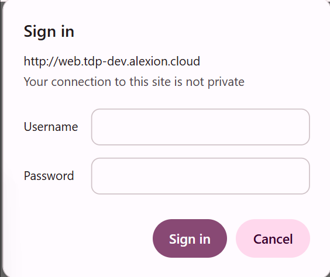
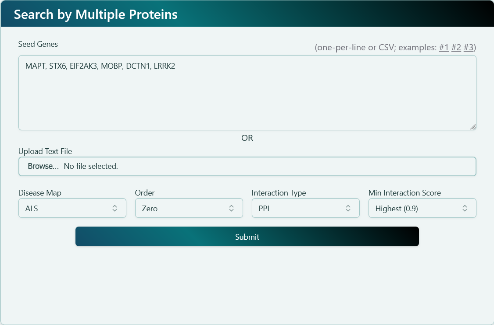
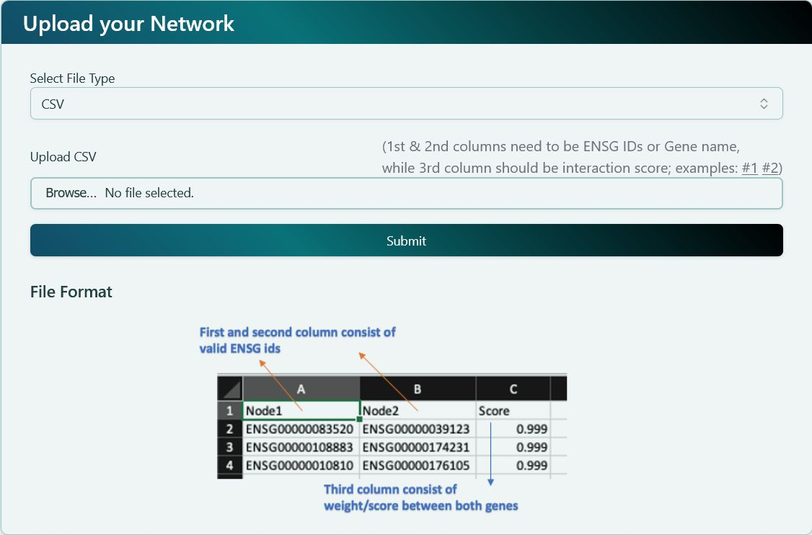

import { Steps } from 'nextra/components';

# Overview

**Welcome to our Interactive Network Visualization tool!**

### **Getting Started**

Welcome to the **Getting Started Guide** for Interactive Network Visualization tool! Here you will find all the necessary steps to get started with our platform.

<Steps>
### Logging In

Log in with your credentials by following these steps:

1. Go to the login page.
2. Enter your username and password.
3. Click the `Login` button.

### Navigating the Dashboard

After logging in, you will be taken to the dashboard. Here’s a quick overview:

- **By protein name**: Enter gene names or Ensembl IDs to generate the network. You can find detailed explanation on the page of [Dashboard - By protein name](docs/dashboard/by-protein-name.mdx).

- **Upload a file**: Upload a network file to generate the network. You can find detailed explanation on the page of [Dashboard - Upload a file](docs/dashboard/upload-a-file.mdx).

### Rendering the Network Visualization

Once deciding the network, our platform will render the network based on your selections. Here is what you can expect on network visualization page:

- **Left panel**: Provides basic functions to analyze the network. You can find detailed explanation on the page of [Network Visualization - Left panel](docs/network-visualization/left-panel.mdx).
- **Right panel**: Provides advanced functions and modifies the network settings. You can find detailed explanation on the page of [Network Visualization - Right panel](docs/network-visualization/right-panel.mdx).

</Steps>

#### Common Issues

If you encounter any issues, check our [FAQ page](docs/faq.mdx). You can also check [Use Cases](docs/use-cases-and-short-help-videos.mdx) for a quick hands-on.
