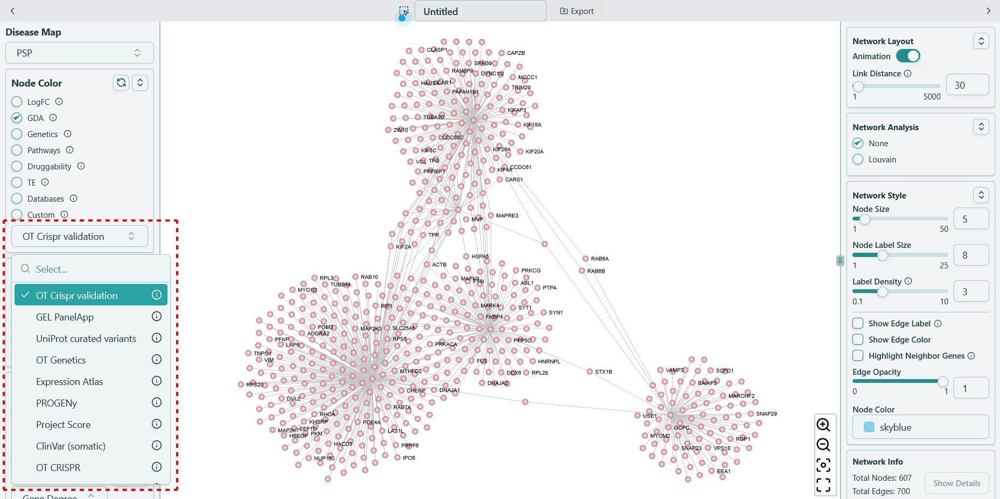
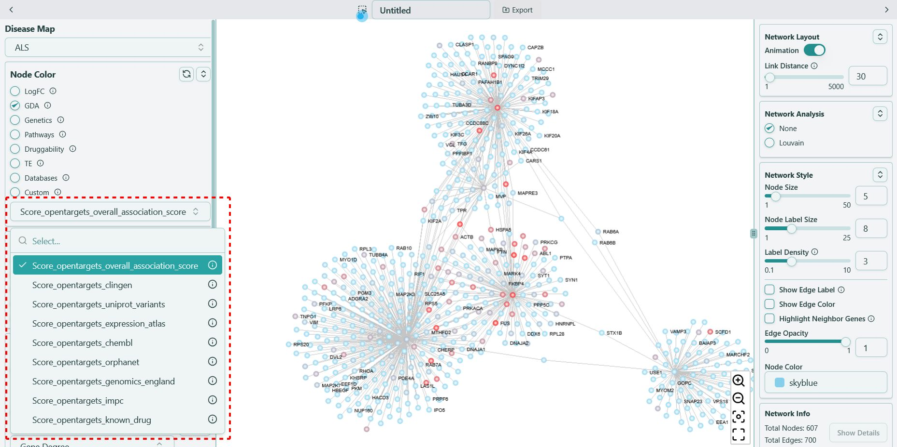

# GDA

**Target disease association scores from Open Targets Platform, value ranging from `0` to `1`**

Gene disease association score is from Open Targets portal. It qualifies the strength of the association between a gene and a disease. This score is derived using a combination of evidence from diverse data sources, e.g. genetic studies, transcriptomics, somatic mutations, drugs and pathways, etc.

We have 4 different diseases — PSP, ALS, FTD and OI.

## PSP & FTD

The PSP and FTD data in Open Targets is shown as below, where you can see the scores of different gene-disease association combinations.

We transformed the data from Open Targets into the CSV format below, then inserted into our knowledge base.

The naming convention of OpenTargets data in the knowledge base follows the format of **\{gene-disease association type\}**, for example, "OT Crispr validation", shown as below:

## ALS & OI

ALS and OI OpenTargets data are also from Open Targets, but the name convention is slightly different from PSP and FTD data. We use **\{disease name\}\_\{"OpenTargets"\}\_\{"Score"\}\_\{"opentargets"\}\_\{gene-disease association type\}** as the format, for example, "ALS_GDA_Score_opentargets_overall_association_score", shown as below:

