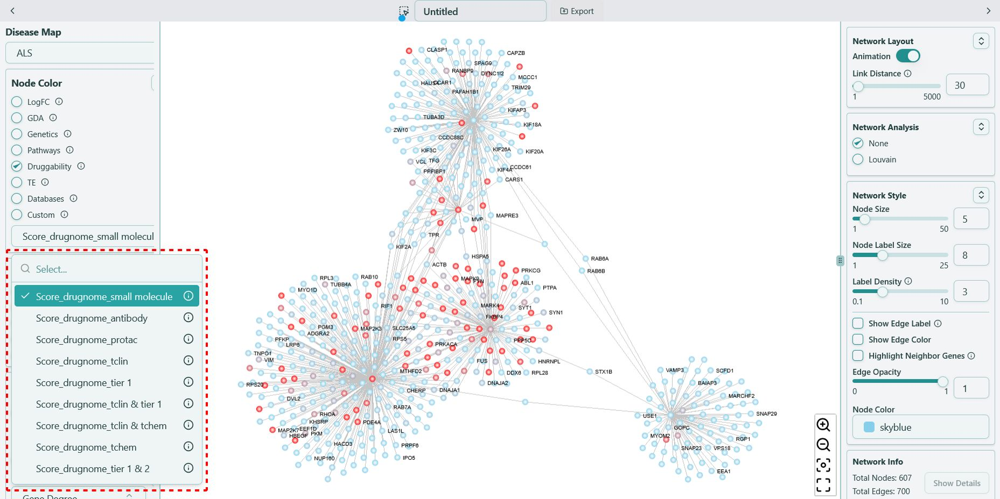

# Druggability

**Druggability scores from DrugnomeAI/Mantis-ML, ranging from `0` to `1`**

Druggability scores are derived directly from DrugnomeAI, it estimates the druggability likelihood for every protein-coding gene in the human exome [\[1\]](druggability.mdx#citation).

Druggability scores is represented in both color and size. The color range start from “blue” to “red” where more “red” means it is more druggable whereas blue means less druggable. We use **\{"drugnome"}\_\{disease-agnostic/domain specific model}** as the format, for example, “drugnome_small molecule”, shown as below:

For more information, please refer to their [website](https://astrazeneca-cgr-publications.github.io/DrugnomeAI/features.html).

### Citation

> _\[1] Arwa et al. DrugnomeAI is an ensemble machine-learning framework for predicting druggability of candidate drug targets. Commun Biol 2022 Nov 24;5:1291. doi: 10.1038/s42003-022-04245-4_
