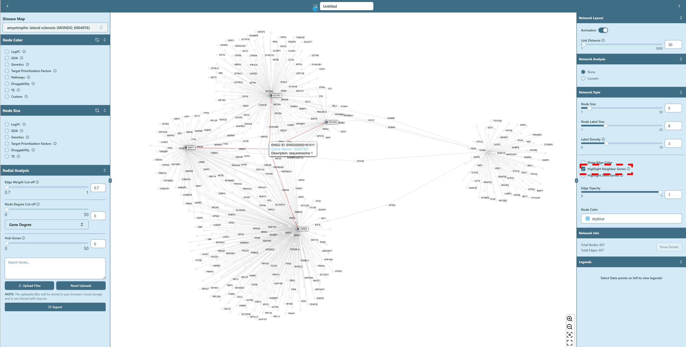

# Network Visualization

**Provide various functions for network analysis**

Right now you enter the network visualization page, shown as below, where you can analyze your network based on your selections on [Dashboard](dashboard.mdx).

Network visualization page contains the [Left panel](network-visualization/left-panel.mdx), [Right panel](network-visualization/right-panel.mdx) and [Network visualization board](network-visualization/network-visualization-board.mdx). Left panel focuses on the functions related to basic analysis of the network, while Right panel focuses on the advanced analysis functions and modifications of inherent network parameters. Network visualization board provides the interactive operations for users to apply various analysis on the network.

### Property of genes

- **Gene information** 

If you **hover** on an arbitrary gene (node), you are able to see the corresponding gene information, and all the genes connected with this hovered gene are also highlighted. If you **click** on a specific gene, a small window will show up on the upper right corner on Network Visualization Board, giving you the details about this gene.

- **Highlight seed genes**

If you wish to find the seed genes in the network, navigate to the "Network Style" section on the right panel, and check the box of `Highlight Seed Genes`. The seed genes will be highlighted in the network.

- **Highlight neighbor genes**

You can also highlight the neighbor genes of a specific gene. To do so, you can first navigate to the "Network Style" section on the right panel, and check the box of `Highlight Neighbor Genes`. Then either **hover** or **click** on a specific gene (node) in the network, the neighbor genes of the hovered/clicked gene will be highlighted in the network.

### Property of interactions

- **Edge weight**

If you **hover** on an arbitrary edge in the network, you can see the interaction information (edge weight) between two genes (nodes).

- **Edge color**

When you check the `Show Edge Color` in the Network Style section on the right panel, you can find the edge color changes. You can check the "Lengends" on the right panel to see the meaning of the edge color. The edge color is determined by the interaction score between two genes (nodes). The higher the interaction score, the darker the edge color.

