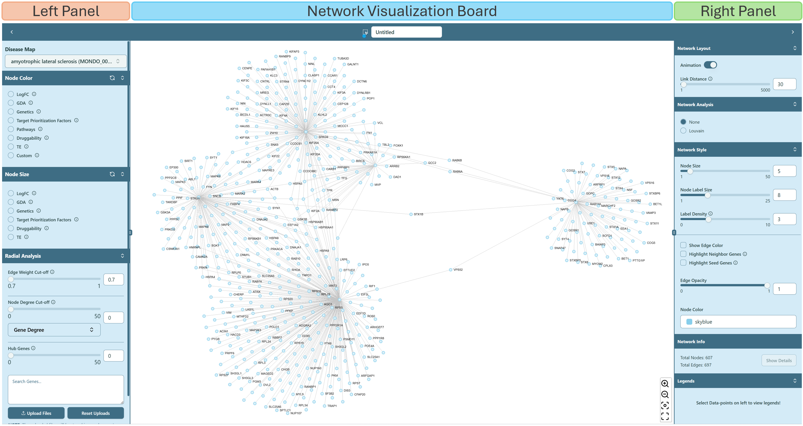
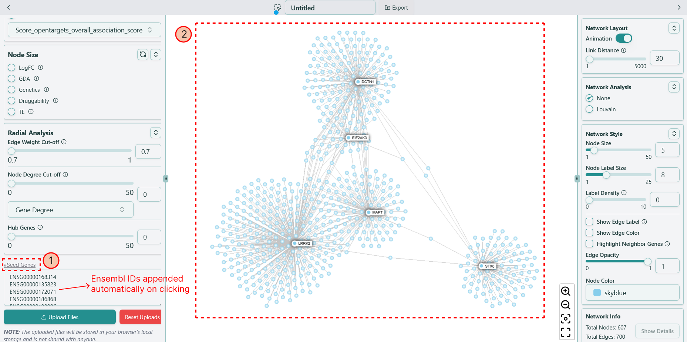
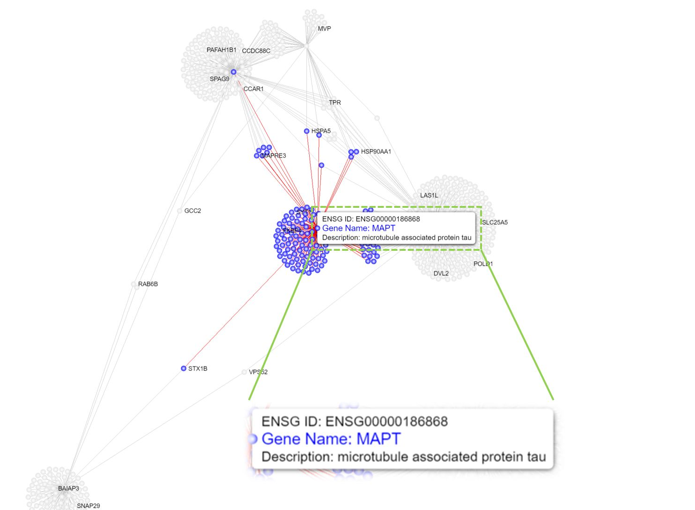
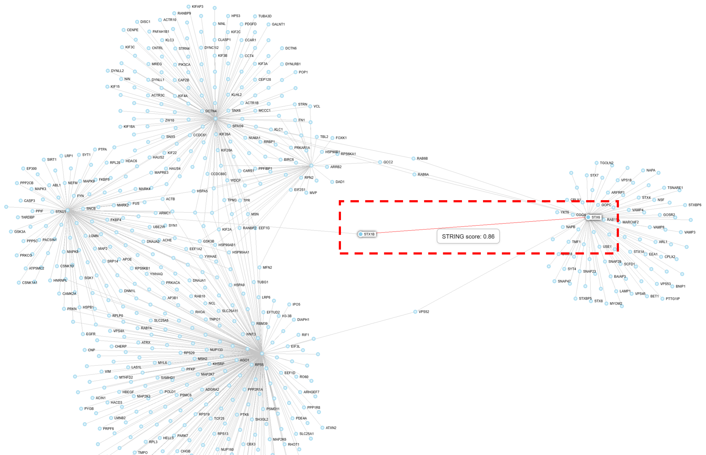

# Network Visualization

**Provide various functions for network analysis**

Right now you enter the network visualization page, shown as below, where you can analyze your network based on your selections on [Dashboard](dashboard.mdx).

### Property of seed genes

If you wish to find the seed genes in the network, navigate to the "Search Genes" textbox on the left panel, and press `#Seed Genes` just above the textbox. The seed genes will be highlighted in the network. Here, "Label Density" is adjusted to 0 to hide all other labels in the network.

### Gene information

If you **hover** on an arbitrary gene (node), you are able to see the corresponding gene information, and all the genes connected with this hovered gene are also highlighted. If you **click** on a specific gene, a small window will show up on the upper right corner, giving you the details related to this genes.

### Interaction information

When you check the "Show Edge Label" in the Network Style section on the right panel, and if you zoom in the network (depends on label density) or **hover** on an arbitrary edge, you can see the interaction information (edge weight) between two genes (nodes).

Network visualization page contains the [Left panel](network-visualization/left-panel.mdx), [Right panel](network-visualization/right-panel.mdx) and [Network visualization board](network-visualization/network-visualization-board.mdx). Left panel focuses on the functions related to basic analysis of the network, while Right panel focuses on the advanced analysis functions and modifications of inherent network parameters. Network visualization board provides the interactive operations for users to apply various analysis on the network.
