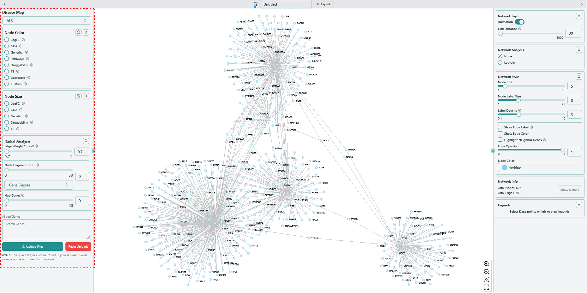
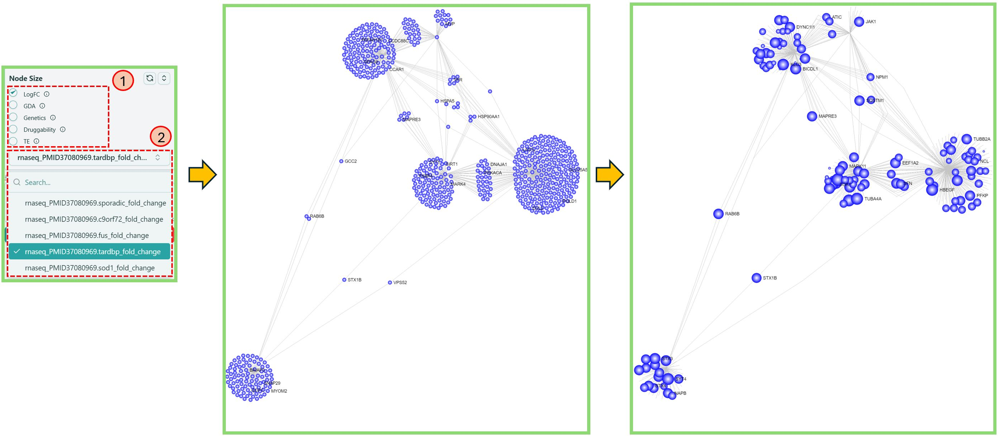
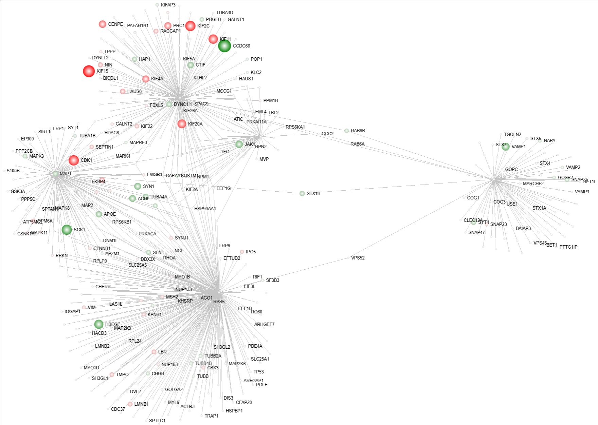
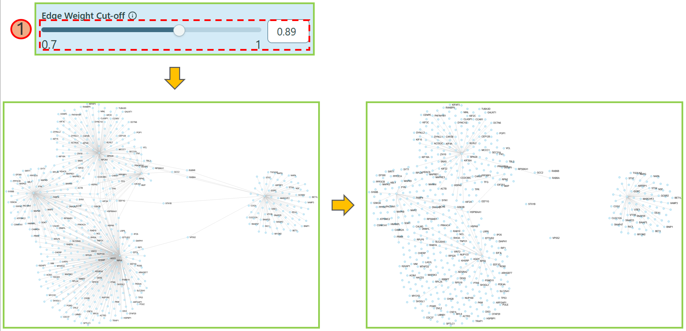
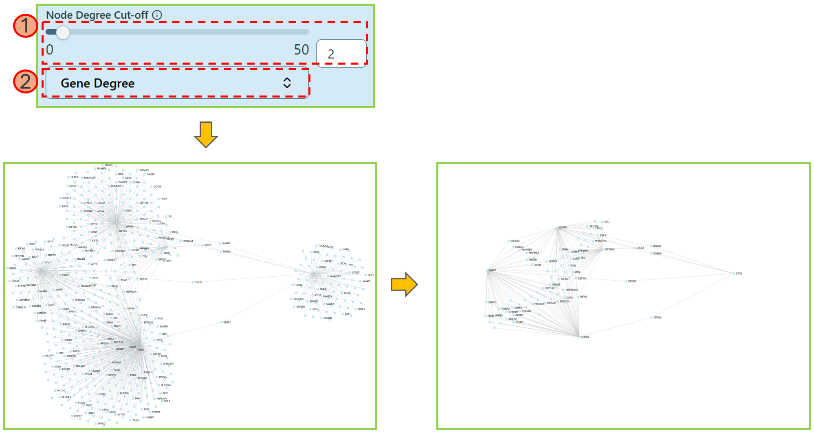
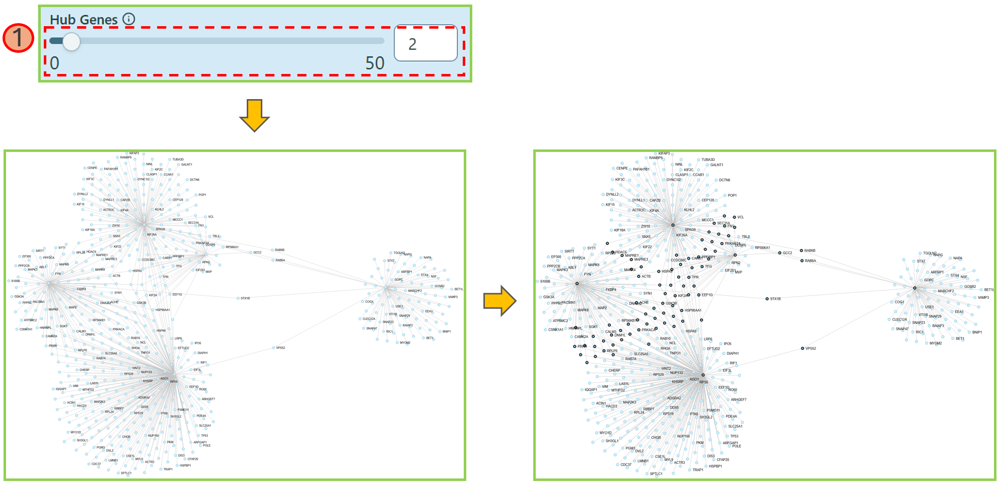
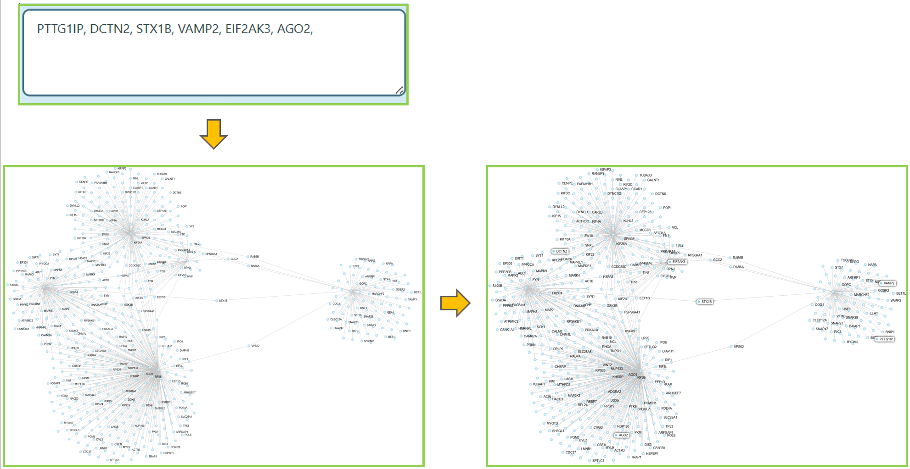
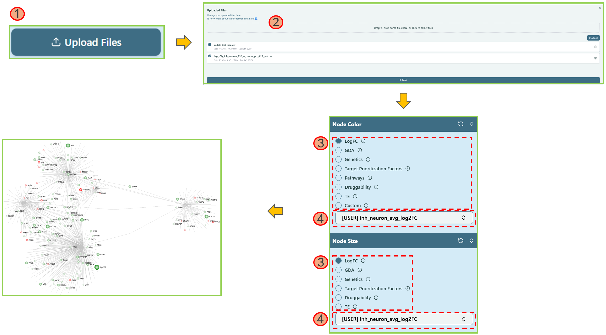
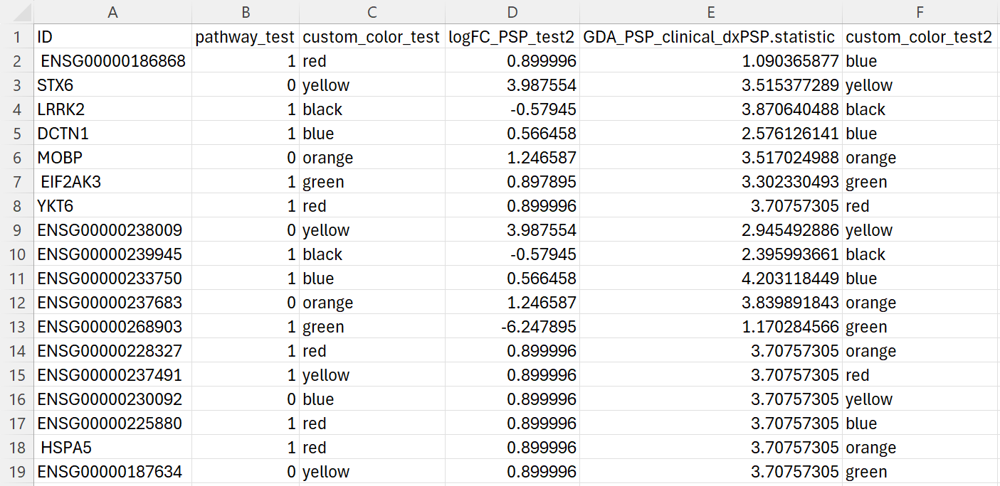

import Image from 'next/image';

# Left panel

**Basic functions related to network analysis**

Once you decide the details of your own network, the network visualization page will show up for basic analysis purpose as below.

Before going over the functions on the left panel, you might want to have some basic understandings of the data available in our tool.

[Knowledge Base](../knowledge-base.mdx) integrated in our tool is build based on [disease-dependent data](../knowledge-base/disease-dependent-data.mdx) and [disease-independent data](../knowledge-base/disease-independent-data.mdx). Disease-dependent data indicates the data of specific features varies based on different diseases, while disease-independent data indicates the data remains the same once the disease changes.

Disease-dependent data includes [LogFC](../knowledge-base/disease-dependent-data/logfc.mdx), [GDA](../knowledge-base/disease-dependent-data/gda.mdx)and [Genetics](../knowledge-base/disease-dependent-data/genetics.mdx), while disease-independent data includes [Pathway](../knowledge-base/disease-independent-data/pathway.mdx), [Druggability](../knowledge-base/disease-independent-data/druggability.mdx), [Tissue Enrichment](../knowledge-base/disease-independent-data/tissue-enrichment.mdx) and [Database](../knowledge-base/disease-independent-data/database.mdx). We also call these data types as **features**.

### Disease Map

Sometimes you may want to switch to another disease after generating the network visualization, no need to go back to the Dashboard to change the disease and re-render the network, here is a simple way to do it:

- Locate **Disease Map** on the top of the left panel and select the disease name that you want to switch to. You can hover on the info icon to check the full name of the selected disease.
- Please note that only the [disease-dependent data](../knowledge-base/disease-dependent-data.mdx) will change if you switch to another disease.

### Change Node Color

You can change the node color by selecting different features.

1. Choose a feature.
   > **Note**: You can hover on the info icon <Image width={30} height={30} src="/image/docs/info-tooltip.png" alt="Info Button" className="inline aspect-square"/> to check the explanation.
2. Select the preferred option for that feature in the dropdown list. You can type the keyword in the search bar to help locate the data name.
   > **Note**: You can check the [Legends](right-panel.mdx#legends) section on the [Right panel](right-panel.mdx) to get the legend of each feature.

### Change Node Size

You can change the node size by selecting a feature.

1. Choose a feature.
   > **Note**: You can hover on the info icon <Image width={30} height={30} src="/image/docs/info-tooltip.png" alt="Info Button" className="inline aspect-square"/> to check the explanation.
2. Select the preferred data for that feature in the dropdown list. You can type the keyword in the search bar to help locate the data name.

We provide less features in Node Size section simply because the feature Pathways is binary features -- either a gene exists in a pathway or it does not exist. However, to change the node size in a network, we need consistent data instead of the binary data.

### Combination of both Node Color and Node Size Change

Node color and node size can be both changed at the same time to highlight the corresponding genes, making them clearer.

### Radial Analysis

- **Edge Weight Cut-off**

This feature allows you to filter out the nodes with less edge weight, so that you can focus more on the clustered nodes.

1. Use the **range slider** or directly **type in** the number to select an appropriate value and filter out the nodes with edge weight less than the selected value.

- **Node Degree Cut-off**

This feature allows you to shrink the network based on the node degree of specific features.

1. In the dropdown list, you can select your preferred feature.
2. Use the **range slider** or directly **type in** the proper number to select an appropriate gene degree, making the network reduced as you want. We currently provide 2 types of values to reduce the network — Gene degree and Tissue Specificity values.

- **Hub Genes**

Hub Genes will highlight the nodes only with larger or equal to the number of edges defined by yourself.

1. Use the **range slider** or directly **type in** the proper number to select an appropriate value to highlight the nodes with node degrees more than or equal to the selected value.

### Custom Search

You can find nodes in the network.

1. Locate the **Search Genes** search box.
2. Enter the gene names or Ensemble IDs into the search box.
   > **Note**: To find seed genes, simply click `#Seed Genes` above the search box.
3. The nodes you are looking for will be highlighted in the network.

### Custom Upload

You can upload your own customized data to analyze the network, instead of using the existing data. Here is a [help video](../use-cases-and-short-help-videos.mdx#custom-upload).

1. Upload a **CSV** file with your own data, please refer to the [File Format](left-panel.mdx#file-format) below.
2. Click Submit.
3. Locate Node Color and/or Node Size section and select the corresponding uploaded feature name.
4. Select the column name of your customized data.

#### File Format

- The table below elaborates the naming convention, and the value ranges for all the supported features (data types).
  - "Custom" data type is for customized color purpose. For example, if you find all the features do not fit your needs, you can create your own "customized feature" and color them by yourself.

| Data Type         | Column Naming Convention                                            | Value range                                                                                                 |
| ----------------- | ------------------------------------------------------------------- | ----------------------------------------------------------------------------------------------------------- |
| LogFC             | LogFC<pre className="inline text-red-500">CustomName</pre>          | [-Inf, +Inf]                                                                                                |
| GDA               | GDA\_<pre className="inline text-red-500">CustomName</pre>          | [0, 1]                                                                                                      |
| Genetics          | GWAS\_<pre className="inline text-red-500">CustomName</pre>         | [-1, 1]                                                                                                     |
| Pathway           | Pathway\_<pre className="inline text-red-500">CustomName</pre>      | Binary (0/1)                                                                                                |
| Druggability      | Druggability\_<pre className="inline text-red-500">CustomName</pre> | [0, 1]                                                                                                      |
| Tissue Enrichment | TE\_<pre className="inline text-red-500">CustomName</pre>           | [0, +Inf]                                                                                                   |
| Database          | Database\_<pre className="inline text-red-500">CustomName</pre>     | Binary (0/1)                                                                                                |
| Custom            | Custom*Color*<pre className="inline text-red-500">CustomName</pre>  | Any hex color code or CSS color name, see list [here ↗](https://www.w3schools.com/colors/colors_names.asp) |

- The CSV file below provides an example of what the real file looks like.
  - The first column must be either gene name or Ensembl id (column name doesn't matter)
  - The prefix of columns is case-insensitive

