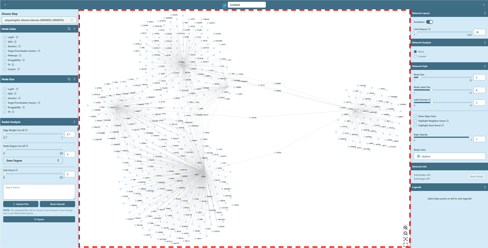
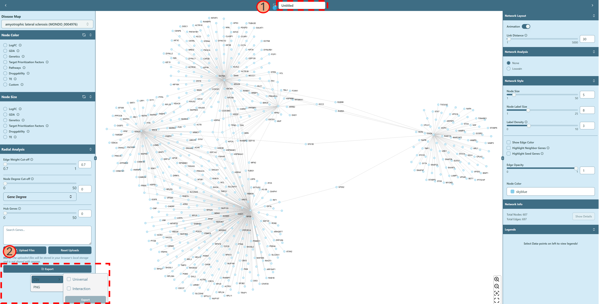
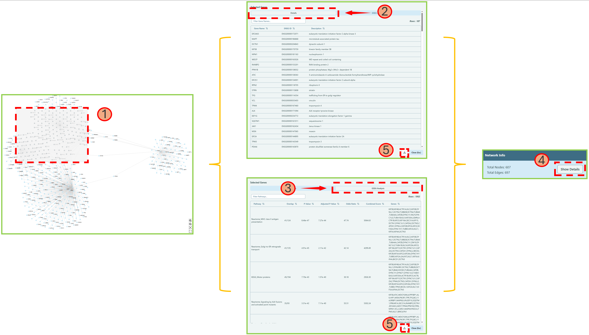

import Image from 'next/image';

# Network visualization board

**Interactive operations to apply various analysis on the network**

Now we focus on the functions of network visualization board. You can **hover** on this icon <Image width={30} height={30} src="/image/docs/help-icon.png" alt="Help Icon" className="inline aspect-square"/> on the top for a quick help of shortcuts.

### Network Export

You can export the network you created.

1. Type in the name of your saved network.
2. Click "Export" button and select proper format. You can export the network in two formats: **CSV** and **PNG**. 
   - CSV: This is a comma-separated-values file that contains the network data, which can be used for further analysis or visualization in other tools. We offer two types of CSV files:
     - Universal: This file contains the nodes (genes) of the network, including Ensembl ID, gene name, and gene description.
     - Interaction: This file contains the edges (interactions) of the network, including the connected 2 genes and their interaction score.
   - PNG: This is a static image of the network, which can be used for presentations or reports.

### Network Parameters

On the right bottom corner of network visualization board, we have four different parameters to help you visualize the network better.

1. <Image
     width={30}
     height={30}
     src='/image/docs/zoom-in-button.png'
     alt='zoom in button'
     className='inline aspect-square'
   />
   : zoom in the network
2. <Image
     width={30}
     height={30}
     src='/image/docs/zoom-out-button.png'
     alt='zoom out button'
     className='inline aspect-square'
   />
   : zoom out the network
3. <Image
     width={30}
     height={30}
     src='/image/docs/center-network-button.png'
     alt='center network button'
     className='inline aspect-square'
   />
   : center the network
4. <Image
     width={30}
     height={30}
     src='/image/docs/fullscreen-button.png'
     alt='fullscreen button'
     className='inline aspect-square'
   />
   : make the network visualization board full screen

### Node Details & GSEA

You can check the node details and perform GSEA (Gene Set Enrichment Analysis) on the network visualization board. Here is a [help video for GSEA](../use-cases-and-short-help-videos.mdx#gsea-analysis).

1. Press `Shift + Click Left Mouse` & drag to select nodes on the network, and the selected nodes will be highlighted with black circle.
2. Click Details tab to obtain the detailed information of selected nodes.
3. Click GSEA Analysis tab to obtain the more detailed information of GSEA Analysis Results.
4. Navigate to [Network Info](right-panel.mdx#network-info) section of [Right panel](right-panel.mdx), click Show Details button to get back to the Node details and GSEA Analysis result window.
5. If needed, click download button in the window to export the results.

