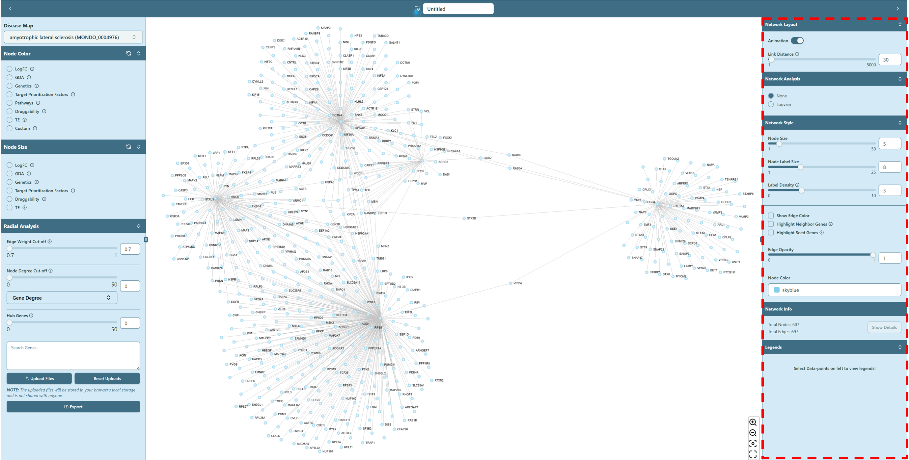
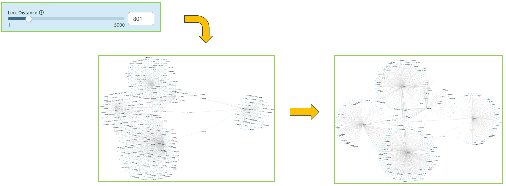
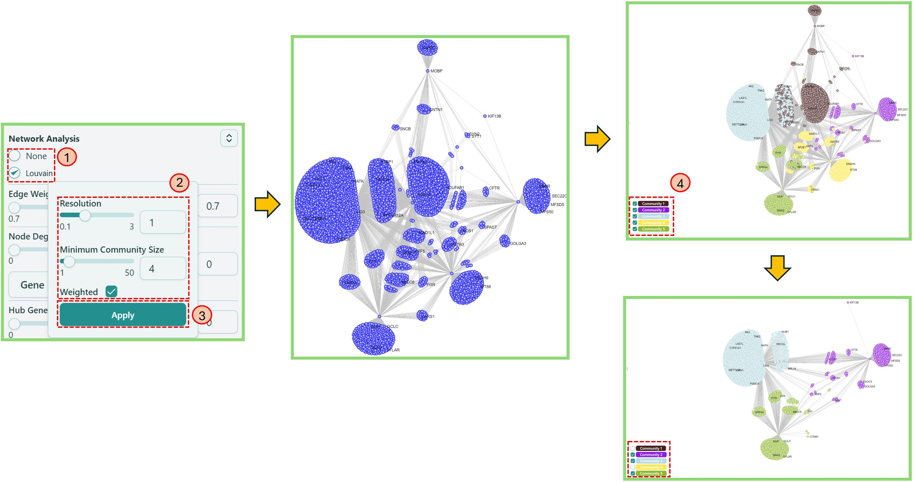
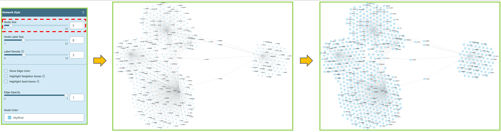
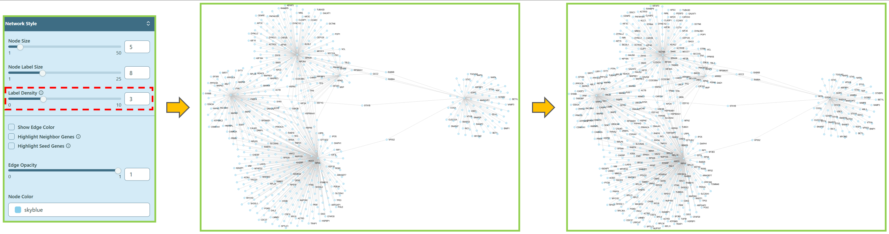
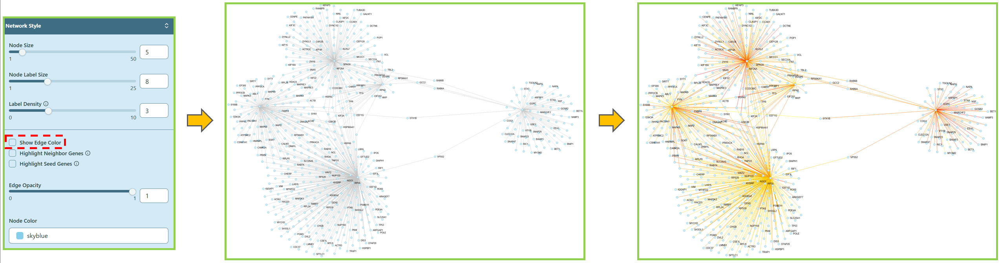
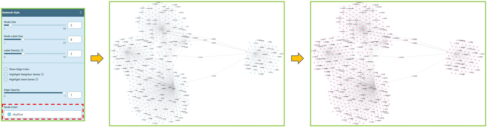

import Image from 'next/image';

# Right panel

**Modifications of inherent network parameters**

Now we focus on the functions of right panel.

### Network Layout

You can make the node clusters more separated. Use the **range slider** or directly **type in** the proper number in Link Distance, this will make the edge of the network longer, helping the clusters separated from each other.

You can also use "Stop Animation" button to stop dancing of the network.

### Network Analysis

You can reduce the network complexity and focus on the key drivers of your network here by selecting different radio buttons.

* **Community detection**

We offer community detection algorithm **Louvain** [\[1\]](right-panel.mdx#citation) in our tool, you can easily use this algorithm to find possible communities in the network, based on your own choice of **Resolution**, **Minimum Community Size** and **Weighted**. Here is a [help video](../use-cases-and-short-help-videos.mdx#community-detection).

1. Click Louvain.
2. Select proper Resolution and Minimum Community Size, check or uncheck Weighted, to involve edge weight or not.
3. Click Apply.
4. Select/Deselect communities to keep/drop the detected communities in the network.

### Network Style

You can change basic parameters of the network.

* **Node Size**

You can make node size larger/smaller.

* **Node Label Size**

You can make node label size larger/smaller.

* **Label Density**

You can change the label density here.

* **Show Edge Label**

You can make edge label (edge weight) appear/disappear. To view more edge labels, simply zoom in the network.

You can also refer to the information icon <Image width={30} height={30} src="/image/docs/info-tooltip.png" alt="Info Button" className="inline aspect-square"/> for the large network tips.

* **Show Edge Color**

You can change the edge color here. Please refer to the Legends section on the [Right Panel](right-panel.md) for the color meaning.

* **Node Color**

You can change the node color here, simply by selecting different color or type different color names.

### Network Info

When the network is rendered, the basic information of the network is shown here, i.e. total nodes, total edges.

You can also click `Show Details` button after selecting the nodes in the network. Please refer to [Node Details & GSEA in Network visualization board](network-visualization-board.mdx#node-details--gsea) section for more information.

### Legends

You can see the Legend of each feature in Node Color section.

1. Choose a feature in Node Color section on the [Left panel](left-panel.mdx), then navigate to Legends section on the [Right panel](right-panel.mdx) to get the legend of a specific feature.

***

#### Citation

> _\[1\] Hao Lu, Mahantesh Halappanavar, Ananth Kalyanaraman, Parallel heuristics for scalable community detection, Parallel Computing, Volume 47, 2015, Pages 19-37, ISSN 0167-8191, doi: [10.1016/j.parco.2015.03.003](https://www.sciencedirect.com/science/article/pii/S0167819115000472)._